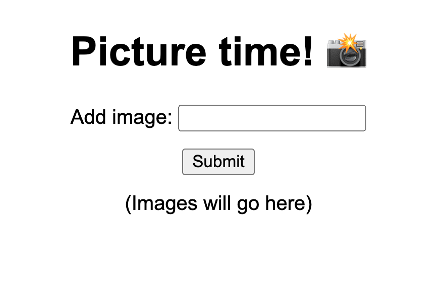
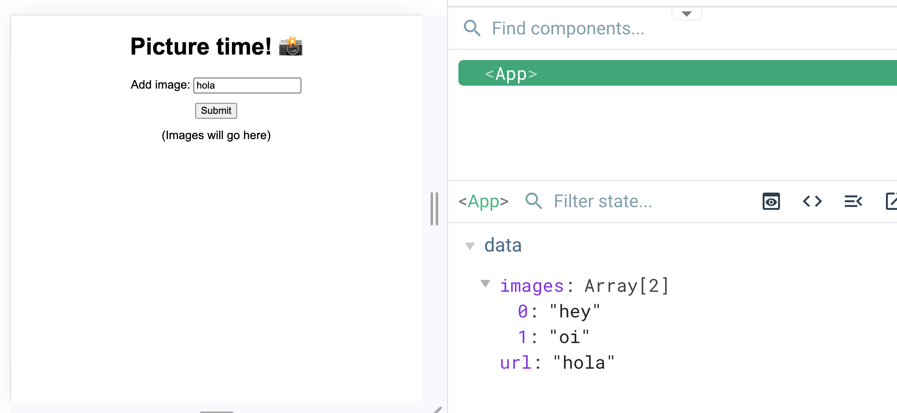
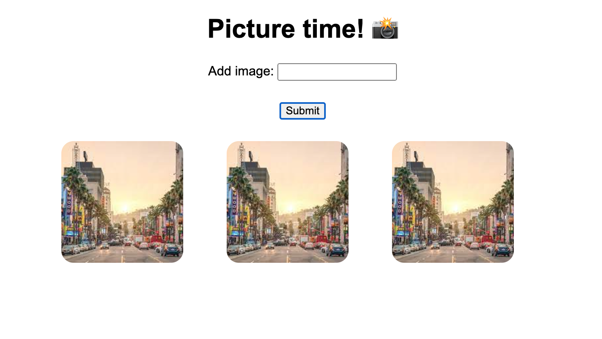

# vue-intro-demo

This template should help get you started developing with Vue 3 in Vite.

## Recommended IDE Setup

[VSCode](https://code.visualstudio.com/) + [Volar](https://marketplace.visualstudio.com/items?itemName=Vue.volar) (and disable Vetur) + [TypeScript Vue Plugin (Volar)](https://marketplace.visualstudio.com/items?itemName=Vue.vscode-typescript-vue-plugin).

## Customize configuration

See [Vite Configuration Reference](https://vitejs.dev/config/).

## Project Setup

```sh
npm install
```

### Compile and Hot-Reload for Development

```sh
npm run dev
```

### Compile and Minify for Production

```sh
npm run build
```

## Tasks

### Step 1: Create a form
In App.vue, create a simple form with one text input field and a submit button.

- A text ```input``` field labeled "Add image".
- A ```div``` that will hold images. (No need to add images yet.)
- A "Submit" button.




### Step 2: Add functionality
Add functionality to your "Submit" button - when you click it, it should save your form input (an image URL), to your data.

- Create data called "images", and initialize it as an empty array.
- Add data binding to your input field.
- On button click, push the input into your "images array".



### Step 3: Display your images
Render all of your saved images in your image grid.

- Using ```v-for```, loop through your "images" data, and create an `````` tag for each one.
- Add some styling so that your images are a manageable size, arranged in a grid, evenly spaced and centered.
- When you add a new image with your "Submit" button, it should appear automatically in your grid.



### Step 4: Separate your image grid into its own component
Our App.vue is getting a little long -  let's separate the image grid into its own component!

- Create a folder called "components", and inside that, create a file called "ImageGrid.vue"
- Move the relevant HTML (the code in ```<template>```) for your image grid into that component (and delete from App.vue)
- Make sure you're importing, exporting, and rendering everything correctly. 

### Step 5: Pass props from the parent
One problem: now your component doesn't have access to your ```images``` data! 
Pass it as a prop to the child component ```ImageGrid```, so it renders correctly again.

### Step 6: Conditional styling
In your ```ImageGrid```, create buttons that say "big" and "small".
Clicking the "big" button should make the size of your images bigger. Clicking "small" should return them to their original size.
Whichever size is "active" should be clear in the button styling. i.e. If your images are bigger, the "big" button should be highlighted somehow. If the images are small, the "small" button should be highlighted to show that this is the active state.

- Create data called "isBig" and initialize it to false.
- Create a class ```.active```, and add some styling that will highlight the active button.
- Add conditional classes to your buttons. If "isBig" is true, "big" should be ```.active```. If isBig is false, "small" should be ```.active```.
- Add basic functionality: clicking "small" should set "isBig" to false, and clicking "big" should set it to true.
- In your ```<style>``` section, create a new ```img``` class ```.big```, with a larger image size.
- Add a conditional class to your `````` tags: if "isBig" is true, it should have the ```.big``` class and should appear larger.